# Lab 6: Application Deployment Operations

**Goal:** Application Deployment Operations

In this lab you will deploy an application called Pets as a Services (PaaS) on Docker Enterprise Edition that takes advantage of some of the latest features of Docker Universal Control Plane (UCP). UCP is an included component of Docker EE Standard and Docker EE Advanced. The tutorial will lead you through building a compose file that can deploy a full application on UCP in one click. Capabilities that you will use in this application deployment include:

- Docker services
- Application scaling and failure mitigation
- Layer 7 load balancing
- Overlay networking
- Application secrets
- Application health checks

# Deploying the App Load-Balancer

* Before we begin, we need to make sure that the application loadbalancer is configured to work with HRM ( configured later). Configuring an application LB allows us to launch applications and access them via DNS.
* Deploy NGINX on application LB node (`app-lb`) to be used to route application traffic to worker nodes
	* NGINX needs to listen on ports 80/443 and forward to HRM ports configured in [Lab 4](ucp.md).
	* Reconfigure `app-nginx.conf` config file available in this directory with your setup's info by substituting `WORKER_IP` in the config file to match Worker 0 and Worker 1 IP's. Also change the ports used in the `upstream app_443` and `upstream app_80` settings to match what is configured for HRM.
	* Launch the nginx container using `docker run -d -p 80:80 -p 443:443 --restart=unless-stopped --name app-lb -v ${PWD}/app-nginx.conf:/etc/nginx/nginx.conf:ro nginx:stable-alpine`

#### Configuring Secrets

- PaaS uses a secret to access the Admin Console so that votes can be viewed. Before we deploy PaaS, the UCP administrator has to create a secret in UCP.  Adjust the [pets-prod-compose.yml](../resources/pets-prod-compose.yml) file so that it matches the name of your secret. The environment variable `ADMIN_PASSWORD_FILE` must match the location and name of your secret. The default in the compose file is `ADMIN_PASSWORD_FILE=/run/secrets/admin_password` if your secret is named `admin_password`. Use whatever secret you like. If your secret is named `mysecret` then the value of `ADMIN_PASSWORD_FILE` would be `/run/secrets/mysecret`.

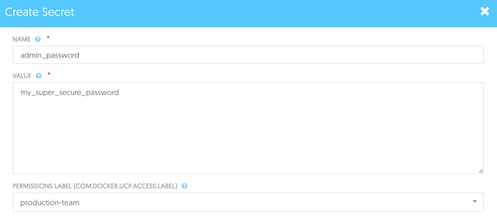 

#### Configuring HRM
- Configure the `pets-prod-compose.yml` with the correct HTTP Routing URLs. Replace `<pets.url>` with  the value `*-YOUR_TEAM-app-lb.dckr.org`. 

- **MTA App Instructions:** Edit your AtSea `docker-compose.yml` by adding labels for HRM. Note, whatever external URL you pick, add that URL and the public IP of your app load balancer to your hosts file.

#### Deploying with Compose
- Now deploy the application with your edited compose file from [pets-prod-compose.yml](../resources/pets-prod-compose.yml) in UCP as a Docker stack.

- Check the stack's service status and the logs for the `web` service. It will take up to 30 seconds for the app to become operational. Try going to one of the ports or URLs that the app is running on. You will see the event in the `web` service.

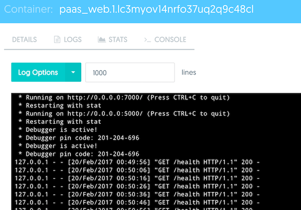 

- **MTA App Instructions:** Deploy the MTA app `docker-compose.yml` in UCP as a Docker stack. 

#### Load Balancing 
- If the app DNS and HRM (L7 load balancing) are configured correctly you can access on the app CNAME.

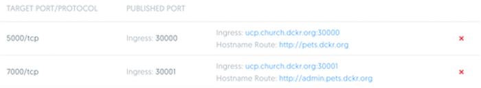 

- Access the PaaS client page. Input your name and vote for a specific animal.

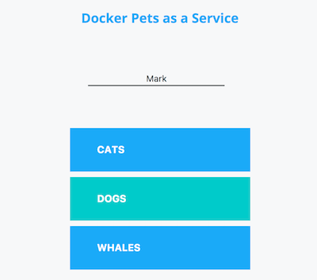 

- Reload the page to serve new animals by pressing `Serve Another Pet`. See that you are being load balanced between multiple containers. The container ID will switch between the number of container in the `web` service, illustrating the Docker Routing Mesh.

- Feel free to hit `Vote Again` if you wish to change your vote.

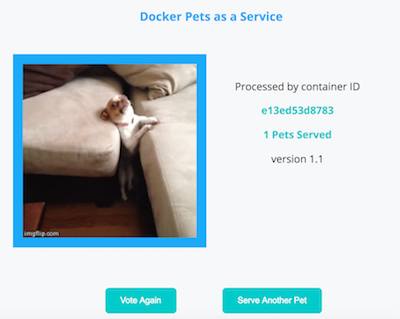 

- Log in to the admin console using the URL or port exposed by UCP. To access the Admin portal go to ANY_NODE_PUBLIC_IP:7000 . Use the secret password specified in Step 1.

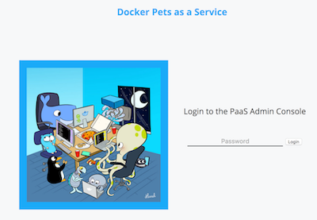 

- Now view the votes!

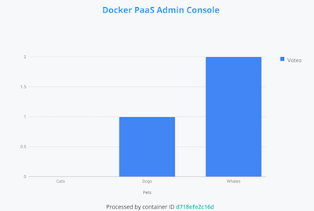 

#### Sticky Sessions
- You may have noticed that the voting page load balances across the web container IDs. When you go to the Admin console, you will notice that the container ID presented is the same every time. That is because UCP is using the `sticky_sessions` option of the L7 load balancer. 

- Try going to the port that is exposed by the Admin Console. The port can be found in the UCP GUI when clicking on the `web` service. Go to this port log in with your secret. Refresh the Admin Console page couple times and you should see the container ID changing. This is because you are accessing it through the L4 port which does not have `sticky_sessions` enabled.

#### Scaling and Deploying Application Instances
- View how the application has been scheduled across nodes with the "Swarm Visualizer." It's running as the `pets-viz` container and you can access it using ANY_NODE_PUBLIC_IP:8080.

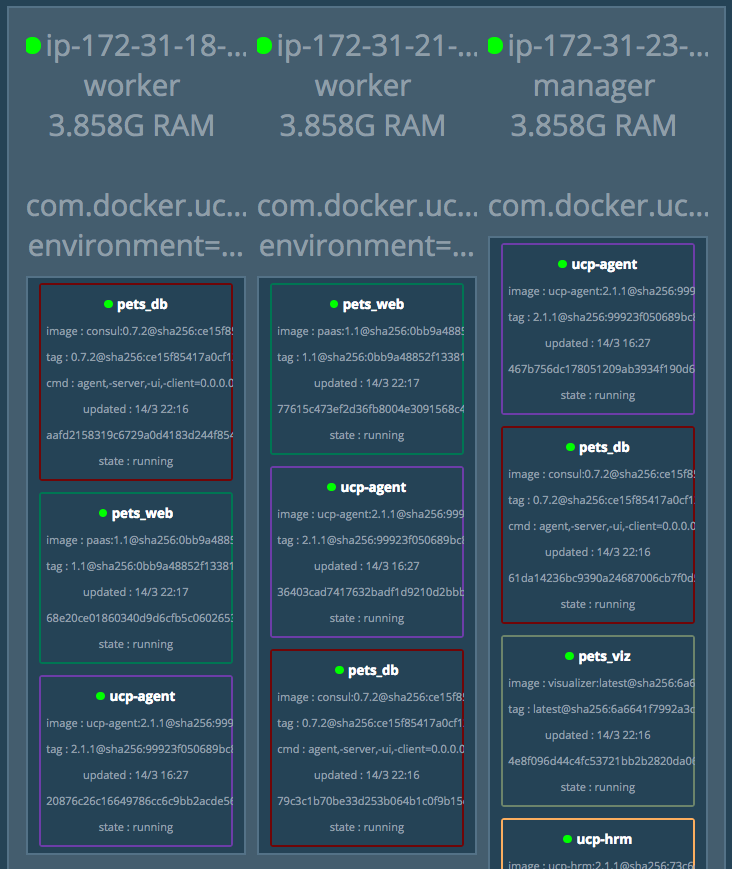 

- Scale the pets application by changing the replicas parameter for the `paas_web` service to `6`. In `pets-viz` we can see additional nodes get scheduled. Back in the application you can see that `Serve Another Pet` is now load balancing you to more containers.

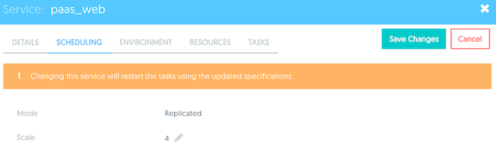 

- Now initiate a rolling deployment. For the `pets_web` service change the following paramaters and click `Save Changes`
   - Image `chrch/paas:1.1-broken`
   - Update Parallelism `1`
   - Update Delay `5`
   - Failure Action `Pause`
   - Max Failure Ratio `0.2` (20%)

- Look at the visualizer and you will see that the health checks never pass for this image. Watch for up to 30 seconds. Now go back to the UCP GUI and click on `pets_web`. You will see that the rollout has been paused because the rollout has passed the failure threshold of 20%. Now initiate a rolling deployment again, but this time use the image `chrch/paas:1.1b`

 
- **MTA App Instructions:**  A patch has been released to solve a bug on the homepage of the AtSea app.  Drop the new `.war` file below into a new version `2.0` of your application.  Initiate a rolling deployment with your MTA app to roll the patch with **NO DOWNTIME**. Update your web/Tomcat service with:
  - `.war` file: `https://broyal.blob.core.windows.net/mta/mta-java.2-0.war`
   - Image `<your updated image name:tag>`
   - Update Parallelism `1`
   - Scale `5`

#### Managing the Application Lifecycle
- Check that the application health check is working by going to `/health`. This health check endpoint is advertising the health of the application. UCP uses this health metric to manage the lifecycle of services and will kill and reschedule applications that have been unhealthy.

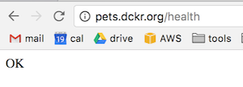

- Toggle the health check to be unhealthy by going to `/kill`. This URL will make the `/health` endpoint of one of the `web` containers return `unhealthy`. Now return to the web browser to see that one of the containers has toggled to unhealthy. Continue to refresh and see what happens. The container will be killed and rescheduled by Swarm automatically. It will be replaced by a new `web` container.

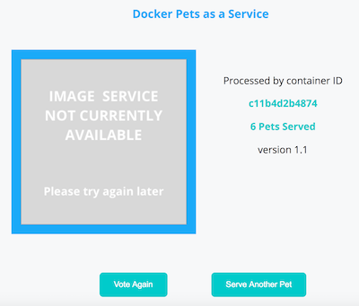 

- Now go to one of your worker nodes and kill the worker engine with `sudo service docker stop`. In the swarm visualizer you will see the node dissappear and the engines will be rescheduled on the remaining nodes.
