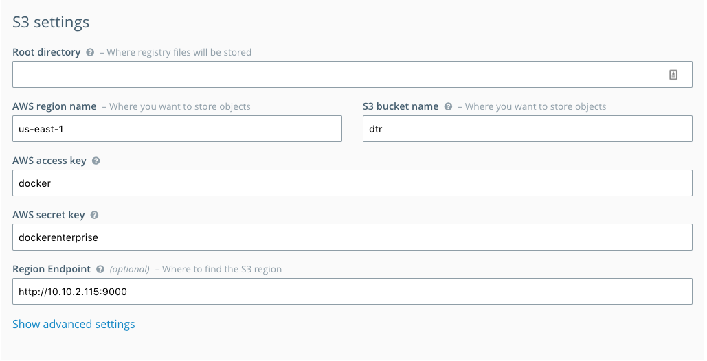

# Lab 5: Install and configure highly available DTR


**Goal:** Install and configure highly available DTR. 

1. Generate and Install Let's Encrypt certificates for DTR domain.
	* SSH into the `dtr-lb` node.
	* Retrieve the node's proper DNS CNAME record that's assigned to it.
	* You can use Let's Encrypt to generate certs. Make sure you substitute `YOUR_EMAIL` and `DTR_LB_CNAME` variables:
		
		```
		 docker run --rm \
		    -p 443:443 -p 80:80 --name letsencrypt \
		    -v "/etc/letsencrypt:/etc/letsencrypt" \
		    -v "/var/lib/letsencrypt:/var/lib/letsencrypt" \
		    certbot/certbot:latest \
		    certonly -n -m $YOUR_EMAIL -d $DTR_LB_CNAME --standalone --agree-tos
		```
		
	* This operation will generate the SSL certs for the DTR domain.  
	* Under `/etc/letsencrypt/live/$DTR_LB_CNAME` you'll find the following:
	
		- cert.pem: server certificate only.
		- chain.pem: root and intermediate certificates only.
		- fullchain.pem: combination of server, root and intermediate certificates (replaces cert.pem and chain.pem).
		- privkey.pem: private key (do not share this with anyone!).

2. Deploy HAPROXY on UCP LB node (`dtr-lb`)
	* SSH to the `dtr-lb` node.
	* HAPROXY needs to listen on ports 80/443 and forward to non-standard port of DTR. Please use port *12391* for HTTP and *12392* for HTTPS as the backend ports. 
	* Copy the `dtr-haproxy.cfg` file located in this directory found [here](../dtr-haproxy.cfg) to the `dtr-lb` node and reconfigure it with your setup's info by substituting `MANAGER_IP` in the config file with the PRIVATE IP address of the three manager nodes. Then launch the haproxy container using the following command:
	
		```
		docker run -d -p 443:443 -p 80:80 -p 8181:8181 --restart=unless-stopped --name dtr-lb -v ${PWD}/dtr-haproxy.cfg:/usr/local/etc/haproxy/haproxy.cfg:ro haproxy:1.7-alpine haproxy -d -f /usr/local/etc/haproxy/haproxy.cfg
		```	

3. Install DTR Version `2.3.2`. 
	* Make sure to use correct external URL for DTR( e.g `--dtr-external-url`). This should be `dtr-lb`'s CNAME provided. 
	* Make sure to use non-standard ports *12391* for HTTP and *12392* for  HTTPS for **each** replica using the `--replica-http-port` and `--replica-https-port` flags.
	
4. Install three DTR replicas on the Manager nodes

5. Install the generated certs for DTR. You need to use `fullchain.pem` for TLS certificate chain, `privkey.pem` for the TLS Private Key, and [this](../config/ca.pem) cert as the CA Root Cert. 

6. Configure Storage Backend.
	* Minio, an S3 Compatible Object storage, is configured already on the `services` node. Please use the following configuration to set it up.
	* Go to $SERVICES-PUBLIC-IP:9000
	* Create a Bucket (lower right corner) and call it `dtr`
	* Go back to DTR URL, and go to **Settings** > **Storage**.
	* Select S3 and provide the required parameters. Make sure to use your own `services` private IP as the **Region Endpoint** Here's a sample configuration:

		- Access Key: `docker`
		- Secret Key: `dockerenterprise`
		- Region Name: `us-east-1`
	
	 
	
	* Confirm your configuration worked:
		* Create your first repository under the `admin` namespace.
		* Perform a `docker login` from your local Docker client.
		* Perform a docker push to confirm that storage backend is configured. 

7. Set up Docker Security Scanning using the following [documentations](https://docs.docker.com/datacenter/dtr/2.2/guides/#security-scanning).

8. Perform a DTR Backup.

10. Enable [garbage collection](https://docs.docker.com/datacenter/dtr/2.3/guides/admin/configure/garbage-collection) and ensure it runs every-night at midnight.
