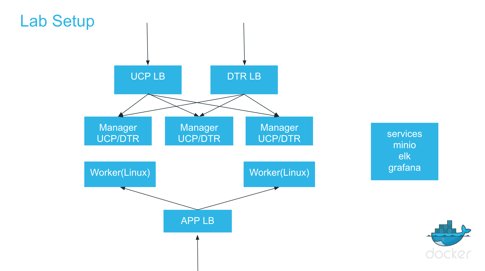

# DAC Lab Environment

- There are a total of 3 labs covering EE fundamentals (orchestration, networking, security) and advanced UCP and DTR features.
- You will complete the labs as a team (2 per team).

## Environment Details
- Each team will receive a setup of its own which will include:
  
  * Shared VPC, private and public subnet, security groups.
  * 9 Nodes
	 - `manager-node0`: Cluster Manager Node to have UCP manager and DTR replica
	 - `manager-node1`: Cluster Manager Node to have UCP manager and DTR replica
	 - `manager-node2`: Cluster Manager Node to have UCP manager and DTR replica
	 - `worker-node-0`: Worker Node
	 - `worker-node-1`: Worker Node
	 - `ucp-lb`: UCP Loadbalancer
	 - `dtr-lb`: DTR Loadbalancer
	 - `app-lb`: Application/HRM Loadbalancer
	 - `services`: Used for ELK and Minio
  * Private SSH key to be used to ssh into all nodes
  * Proper DNS CNAME for all nodes.
  * Nodes are using **Centos 7.2** as their base OS.
  * Username to access nodes is **centos** ( e.g `ssh -i <YOUR PRIVATE KEY>.pem centos@<PUBLIC_IP>`

